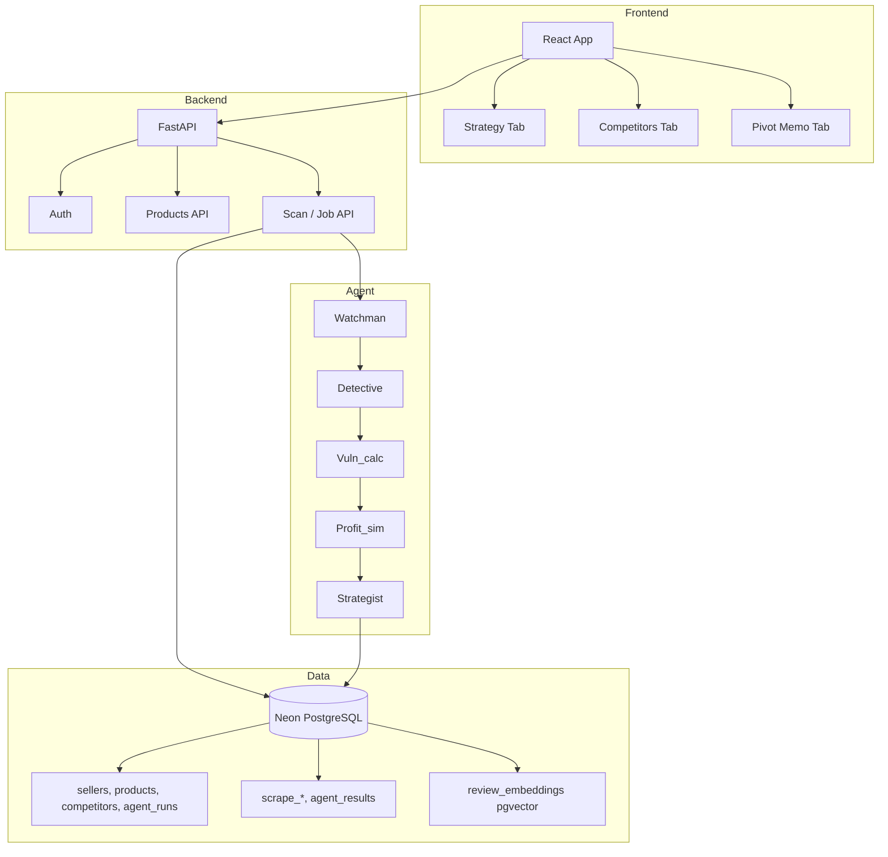

# Shadowspy.ai — Detailed Documentation

## Overview

**Shadowspy.ai** is a multi-tenant competitive intelligence platform for e-commerce sellers. It scrapes your product and competitors, embeds reviews in a vector database, and runs an AI agent pipeline to produce vulnerability scores, profit-at-risk simulations, review signals, and an AI-generated pivot memo.

---

## Table of Contents

1. [Problem & Solution](#1-problem--solution)
2. [Methodology & Implementation](#2-methodology--implementation)
3. [Technology Stack](#3-technology-stack)
4. [Architecture](#4-architecture)
5. [Database Schema](#5-database-schema)
6. [Agent Pipeline](#6-agent-pipeline)
7. [API Reference](#7-api-reference)
8. [Frontend Structure](#8-frontend-structure)
9. [Setup & Configuration](#9-setup--configuration)
10. [Feasibility & Scaling](#10-feasibility--scaling)

---

## 1. Problem & Solution

### Problem

- E-commerce sellers lack real-time visibility into competitor prices, ratings, and review sentiment.
- Manually matching competitor prices can **erode margin** without a clear view of profit impact.
- It is difficult to decide **when to hold price, match price, or invest in ads**.
- There is no single place that turns raw competitor data into **actionable strategy**.

### Solution

Shadowspy.ai provides:

- **Multi-tenant dashboard**: Each seller registers, adds products and competitors, and runs scans per product.
- **Automated pipeline**: Scraping → embedding → signal extraction → vulnerability scoring → profit simulation → strategy memo.
- **Bleeding logic**: Competitors with very low ratings (~2-star) are flagged as “bleeding” (negative impact); the memo recommends leveraging quality/trust instead of chasing their price.
- **Profit-at-risk simulation**: Three strategies (Match Price, Hold Price, Ad Campaign) with net ₹ impact and bar/pie charts.
- **Single cloud DB (Neon PostgreSQL)** for app data, scrape logs, and vector embeddings to reduce operational complexity.

---

## 2. Methodology & Implementation

### Pipeline Stages

| Stage | Node | Purpose |
|-------|------|---------|
| 1 | **Watchman** | Scrape product + competitors (Amazon/Flipkart/Snapdeal); save price and review stats; embed reviews into pgvector. |
| 2 | **Detective** | Semantic search over reviews + LLM to classify signals (e.g. distress vs competitive pricing, quality defects). |
| 3 | **Vuln_calc** | Compute vulnerability score per competitor (sentiment, price drop, review spike, rating); apply **bleeding** for low-rated competitors. |
| 4 | **Profit_sim** | Compute net impact for Match Price (lowest competitor price), Hold Price, and Ad Campaign using seller price/cost and baseline units. |
| 5 | **Strategist** | LLM synthesizes a Pivot Memo (situation, recommended actions, what not to do) using vuln_scores, signals, and profit_sims. |

### Implementation Notes

- **LangGraph** orchestrates the pipeline with conditional edges (e.g. re-run Watchman if Detective confidence &lt; 0.7; run Profit_sim only when cost/price is available).
- **Backend** (FastAPI) exposes auth, product/competitor CRUD, scan trigger, job result, and SSE stream; persists results in Neon (agent_runs, etc.).
- **Frontend** (React + Vite) shows a tabbed Analysis view: Strategy (profit-at-risk + bar/pie charts), Competitors & signals, Pivot memo.

---

## 3. Technology Stack

| Category | Technology |
|----------|------------|
| Backend | Python 3.x, FastAPI, Uvicorn |
| Auth | JWT (python-jose), bcrypt |
| ORM / DB | SQLAlchemy, Neon PostgreSQL (or SQLite fallback) |
| Vector DB | pgvector (Neon), 1536-d embeddings |
| LLM / Agent | LangGraph, LangChain, Gemini or OpenAI |
| Scraping | requests, BeautifulSoup, platform scrapers |
| Frontend | React 18, Vite, React Router, Axios, Chart.js, Lucide React |
| Config | python-dotenv, .env |

---

## 4. Architecture

### High-Level Flow

```
User (Browser)
    → React app (Vite, port 3000)
    → FastAPI (port 8000): /auth, /products, /scan/:id, /job/:id/result, /job/:id/stream
    → Neon PostgreSQL: sellers, products, competitors, agent_runs, scrape_*, agent_results, review_embeddings
    → Background task: LangGraph pipeline (Watchman → Detective → Vuln_calc → Profit_sim → Strategist)
    → Scrapers + Gemini/OpenAI + pgvector
```

### Mermaid Diagram (render in GitHub or Mermaid-compatible viewer)



---

## 5. Database Schema

### Neon PostgreSQL (when `DATABASE_URL` is set)

**ORM tables (SQLAlchemy, `db/database.py`):**

- **sellers** — id, email, password_hash, business_name, phone, platform, created_at, is_active  
- **products** — id, seller_id, product_name, category, platform, platform_id, price, cost, monthly_units, is_active, created_at, updated_at  
- **competitors** — id, product_id, seller_id, competitor_name, platform, platform_id, notes, is_active, created_at, updated_at  
- **agent_runs** — id, seller_id, product_id, run_id, status, vuln_scores, pivot_memo, profit_sims, signals, error_msg, created_at, completed_at  
- **price_history** — id, product_id, platform_id, price, scraped_at  
- **review_stats** — id, product_id, platform_id, avg_sentiment, review_count, rating, review_spike, scraped_at  

**Raw SQL tables (`api/db.py`):**

- **scrape_price_history** — asin, price, date (scrape log by ASIN)  
- **scrape_review_stats** — asin, avg_sentiment, review_count, rating, review_spike, scraped_at  
- **agent_results** — run_id, product_asin, result_json, created_at (legacy full result)  
- **review_embeddings** — asin, document, metadata, embedding vector(1536), created_at  

---

## 6. Agent Pipeline

### State (`agents/state.py`)

- `product_asin`, `competitor_asins`, `scraped_data`, `embeddings_done`, `signals`, `vuln_scores`, `profit_sims`, `pivot_memo`, `confidence`, `loop_count`  
- Optional: `seller_id`, `product_id`, `my_price`, `my_cost`, `monthly_units`, `product_platform`, `competitor_platforms`

### Graph (`agents/graph.py`)

- **Entry**: Watchman  
- **Watchman** → Detective  
- **Detective** → (if confidence &lt; 0.7 and loop_count &lt; 2) Watchman, else Vuln_calc  
- **Vuln_calc** → (if my_cost or my_price or scraped price) Profit_sim, else Strategist  
- **Profit_sim** → Strategist → END  

### Bleeding Logic (`agents/nodes.py`)

- Competitors with **rating ≤ 2.5** (e.g. ~2-star) are marked **Bleeding** (negative impact).  
- They get a `low_rating_bleed` score component and `bleeding_reason: "low_rating"`.  
- The Strategist prompt instructs the LLM to recommend capitalizing on their weakness (quality/trust) rather than matching their price.

### Profit Simulation

- **Match Price**: `match_price = min(competitor prices)`; net impact = (match_margin × est_units) − baseline_profit.  
- **Hold Price**: net = 0 (baseline).  
- **Ad Campaign**: ad spend = f(baseline profit); volume lift; net = (margin × est_units) − ad_spend − baseline_profit.  

Results are stored in `agent_runs.profit_sims` and returned to the frontend for cards and charts.

---

## 7. API Reference

### Auth

- `POST /auth/signup` — Register (email, password, business_name, phone, platform)  
- `POST /auth/login` — Login (form: username=email, password); returns JWT and seller  
- `GET /auth/me` — Current seller (Bearer token)  

### Products

- `GET /products` — List products for current seller  
- `POST /products` — Create product  
- `GET /products/{id}` — Get product  
- `PATCH /products/{id}` — Update product  
- `DELETE /products/{id}` — Deactivate product  
- Competitor CRUD under product (e.g. add/update/delete competitors)  

### Scan & Job

- `POST /scan/{product_id}` — Start scan; returns `run_id`  
- `GET /scan/{product_id}/history?limit=` — List runs for product  
- `GET /job/{run_id}/result` — Get run result (vuln_scores, profit_sims, pivot_memo, signals, products)  
- `GET /job/{run_id}/stream` — SSE stream of log events  

### Other

- `GET /logs?limit=` — Backend log lines (from agent.log)  
- `GET /embeddings?asin=&limit=` — List review embeddings (pgvector)  

All authenticated routes require `Authorization: Bearer <token>` unless stated otherwise.

---

## 8. Frontend Structure

- **Router**: `/login`, `/signup`, `/products`, `/products/:id`, `/products/:id/intelligence`, `/settings`  
- **Auth**: `AuthContext`; token in localStorage and Axios client.  
- **Analysis page** (`PageIntelligence.jsx`):  
  - **Tabs**: Strategy & charts | Competitors & signals | Pivot memo  
  - **Strategy tab**: Profit-at-risk cards (Match/Hold/Ad Campaign), bar chart (net impact), pie chart (verdict distribution).  
  - **Competitors tab**: Vulnerability list (with bleeding badge), review signals, agent log, backend logs.  
  - **Pivot memo tab**: AI memo in milestone-style sections; copy button.  
- **Charts**: Chart.js (bar and pie) driven by `results.profit_sims`.

---

## 9. Setup & Configuration

### Environment (.env)

- **DATABASE_URL** — Neon PostgreSQL connection string (required for production).  
- **JWT_SECRET** — Secret for JWT signing (default: shadowspy-secret-2026).  
- **LLM_PROVIDER** — `gemini` or leave unset for OpenAI.  
- **GOOGLE_API_KEY** — For Gemini.  
- **OPENAI_API_KEY** — For OpenAI.  
- Optional: **RAPIDAPI_KEY**, **SCRAPERAPI_KEY** for scrapers; **GEMINI_MODEL** for agent.  

### Run

- **Backend**: `cd profitstory_ci && ./venv/bin/uvicorn api.main:app --reload --port 8000`  
- **Frontend**: `cd profitstory_ci/frontend && npm run dev -- --host`  
- Open http://localhost:3000; sign up and add a product + competitor, then run a scan and open Analysis.

### Docs

- **PRESENTATION.md** — Slides: Problem & Solution, Methodology & Implementation, Technology Used, Architecture Diagram, Feasibility, Conclusion.  
- **GEMINI_SETUP.md** — Gemini API and model configuration.  
- **SAMPLE_INPUT.md** — Sample input for a scan.

---

## 10. Feasibility & Scaling

- **Technical**: Standard stack; single DB reduces complexity; agent is modular and testable.  
- **Resource**: Backend and frontend can run on a single small instance; Neon free tier suitable for demo.  
- **Scalability**: Multi-tenant by design; scans are per-product; queue or rate-limit scans as traffic grows.  
- **Maintainability**: Clear modules (api/, agents/, db/, scraper/, frontend/); presentation and this documentation support handover and demos.

---

*Shadowspy.ai — Competitive intelligence for e-commerce sellers.*
