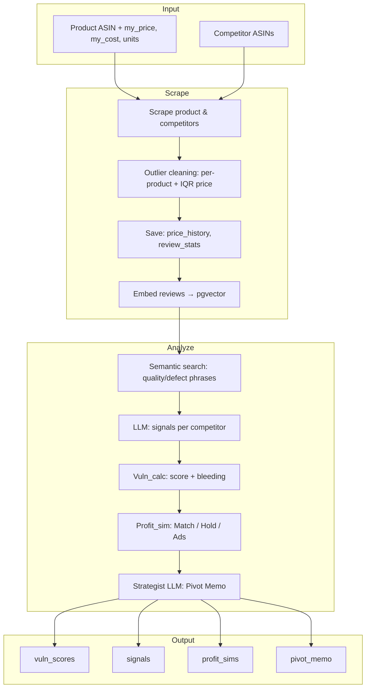
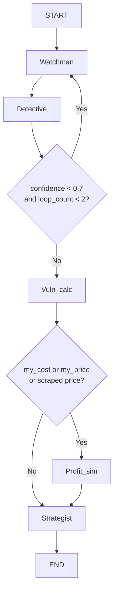
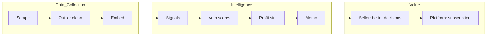
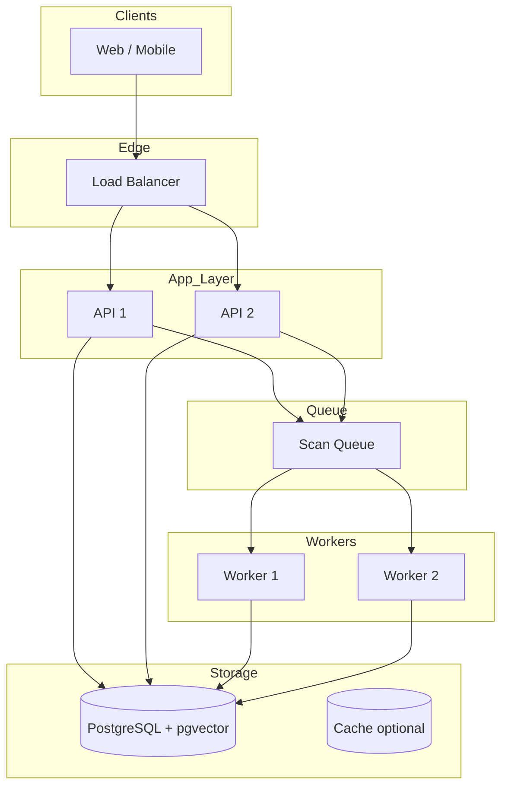

# Shadowspy.ai — Core Methodology, Value & Scaling

This document explains the **core methodology and workflow**, **how the system processes data**, **value and revenue potential**, **practical implementation**, and **scaling**—with flow diagrams.

---

## Table of Contents

1. [Core Methodology & Workflow](#1-core-methodology--workflow)
2. [How the System Processes Data](#2-how-the-system-processes-data)
3. [Value Creation & Revenue](#3-value-creation--revenue)
4. [Practical Implementation](#4-practical-implementation)
5. [Scaling to Larger Users & Deployment](#5-scaling-to-larger-users--deployment)
6. [Diagrams Reference](#6-diagrams-reference)

---

## 1. Core Methodology & Workflow

### 1.1 High-Level Philosophy

Shadowspy.ai turns **raw competitor and review data** into **actionable pricing and strategy** in four steps:

1. **Collect** — Scrape product + competitor pages (price, rating, reviews); clean outliers.
2. **Understand** — Embed reviews in a vector DB; use semantic search + LLM to classify signals (e.g. distress vs competitive pricing, quality issues).
3. **Score** — Compute a **vulnerability score** per competitor (sentiment, price drop, review spike, rating) and apply **bleeding logic** for very low-rated competitors.
4. **Decide** — Run a **profit-at-risk simulation** (Match Price vs Hold vs Ad Campaign) and have an LLM write a **Pivot Memo** (recommended actions, what not to do).

### 1.2 Algorithm Summary

| Stage | Algorithm / Logic |
|-------|-------------------|
| **Outlier cleaning** | Per-product: clamp price (0–10M), rating (0–5), review_count (0–500K); remove empty/duplicate reviews. Cross-ASIN: IQR on prices; cap values outside Q1−1.5×IQR and Q3+1.5×IQR. |
| **Embedding** | Review text → OpenAI/Gemini embedding (1536-d) → stored in pgvector by ASIN + date. |
| **Signal extraction** | Semantic search query ("quality issues sound problems broken defective") over competitor reviews → top matches → LLM classifies: problem_pattern, price_drop_reason (distress/competitive), buyer_intent_shift, confidence, signals[]. |
| **Vulnerability score** | Weighted sum: neg_sentiment (40%) + price_drop (30%) + review_spike (20%) + rating_drop (10%). **Bleeding**: if rating ≤ 2.5, add low_rating_bleed component (up to ~55 pts) and label = "Bleeding". Labels: Bleeding (>70 or low rating), Vulnerable (>40), Stable (>20), Healthy. |
| **Profit simulation** | **Match**: match_price = min(competitor prices); est_units = baseline + 25%; net = (match_margin × est_units) − baseline_profit. **Hold**: net = 0. **Ad Campaign**: ad_spend = max(2000, 15% baseline_profit); est_units = baseline + 50%; net = (margin × est_units) − ad_spend − baseline_profit. |
| **Strategist** | LLM prompt with vuln_scores, signals, profit_sims; instructs to treat "bleeding" competitors as weak (quality/trust angle) and output structured memo (Situation, Action 1/2/3, What not to do). |

### 1.3 Workflow Graph (Conditional Edges)

- **Entry** → Watchman.
- **Watchman** → Detective.
- **Detective** → if `confidence < 0.7` and `loop_count < 2` → **Watchman** (re-scrape); else → **Vuln_calc**.
- **Vuln_calc** → if `my_cost` or `my_price` or scraped price present → **Profit_sim**; else → **Strategist**.
- **Profit_sim** → Strategist → **END**.

---

## 2. How the System Processes Data

### 2.1 Data Flow (Input → Output)

```
INPUT (per scan)
├── Product: platform_id (ASIN), platform, my_price, my_cost, monthly_units
└── Competitors: list of { platform_id, platform }

PROCESSING
├── Watchman: scrape each ASIN → raw { name, price, rating, reviews, avg_sentiment, review_count, review_spike }
│             → outlier cleaning (per-product + cross-ASIN IQR on price)
│             → persist: scrape_price_history, scrape_review_stats, review_embeddings (pgvector)
├── Detective: for each competitor, semantic search on reviews → matched_reviews
│             → LLM(competitor data + matched_reviews) → signals[] (problem_pattern, price_drop_reason, confidence, etc.)
├── Vuln_calc: for each competitor, formula → vuln_scores[asin] = { score, label, bleeding, components }
├── Profit_sim: match_price = min(competitor prices); compute net for Match / Hold / Ad Campaign → profit_sims
└── Strategist: LLM(vuln_scores, signals, profit_sims) → pivot_memo (Markdown)

OUTPUT (stored in agent_runs + returned to frontend)
├── vuln_scores   — per-competitor score, label, bleeding, components
├── signals       — per-competitor LLM analysis
├── profit_sims   — match / hold / ads cards + net profit, verdict
└── pivot_memo    — AI-generated strategy memo
```

### 2.2 Where Value Is Created

- **Outlier cleaning** → more reliable prices and counts for scoring and profit sim.
- **Vector search** → surfaces relevant negative reviews for the Detective (quality/defect signals).
- **Bleeding logic** → prevents “chase the 2-star competitor’s price”; recommends trust/quality instead.
- **Profit sim** → quantifies trade-off (Match vs Hold vs Ads) in rupees.
- **Pivot memo** → one place for the seller to read “do this / don’t do that.”

---

## 3. Value Creation & Revenue

### 3.1 How the Solution Creates Value

| Stakeholder | Value |
|-------------|--------|
| **Seller** | Saves time (no manual tracking of competitors/reviews); gets a clear recommendation (hold vs match vs ads) and profit impact; avoids race-to-the-bottom with low-rated competitors. |
| **Platform (Shadowspy)** | Recurring revenue from subscriptions; optional take-rate on “recommended” ad spend or integrations. |

### 3.2 Revenue Streams & Pricing Models

| Model | Description | Example |
|-------|-------------|---------|
| **SaaS subscription** | Tiered by products/scans per month and number of users. | Free: 1 product, 5 scans/mo; Pro: 10 products, 50 scans/mo — ₹999/mo; Business: unlimited — ₹2,999/mo. |
| **Usage-based** | Pay per scan or per competitor tracked. | ₹50/scan or ₹20/competitor/month. |
| **Freemium + upsell** | Free tier with limited products/competitors; paid for Bestsellers import, history, API, priority support. | Free: 1 product, 2 competitors; Pro: Bestsellers top 20, 90-day history, export. |

### 3.3 Target Customers & Market Applications

| Segment | Use case | Geography |
|---------|----------|-----------|
| **SMB e-commerce sellers** | Amazon.in / Flipkart / Snapdeal sellers with 1–50 SKUs; want to react to competitor moves without eroding margin. | India (Amazon.in, Flipkart, Snapdeal first). |
| **Brands / agencies** | Manage multiple brands or sellers; need audit trail, multi-user, and reporting. | India → expand to other locales (e.g. US/EU) with same methodology. |
| **Marketplaces / accelerators** | White-label or API for “seller intelligence” as a value-add to merchants. | B2B2B. |

---

## 4. Practical Implementation

### 4.1 Why It Is Practical With Current Technology

- **Proven stack**: FastAPI, React, PostgreSQL, LangChain/LangGraph, OpenAI/Gemini embeddings and LLMs. No experimental or proprietary infra required.
- **Single DB**: Neon PostgreSQL holds relational data (sellers, products, agent_runs) and pgvector for embeddings → one connection string, simpler ops.
- **Modular pipeline**: Each node (Watchman, Detective, Vuln_calc, Profit_sim, Strategist) is a pure function over shared state; easy to unit-test and swap (e.g. different LLM or scraper).
- **Scraping**: Direct requests + BeautifulSoup plus optional RapidAPI/ScraperAPI for resilience; outlier cleaning and logging make bad data visible and correctable.
- **Auth & security**: JWT, bcrypt, password policy, audit log, and secure reset are standard patterns and already implemented.

### 4.2 What Exists Today

- End-to-end flow: signup → add product + competitors (manual or Bestsellers top 20) → run scan → view Strategy (profit-at-risk), Competitors & signals, Pivot memo.
- Audit log, password policy, secure password reset, outlier detection + logging.
- Deployable on a single VM or container; Neon free tier sufficient for demo/small production.

---

## 5. Scaling to Larger Users & Deployment

### 5.1 Multi-Tenancy & Concurrency

- **Already multi-tenant**: Every row is keyed by `seller_id`; product and competitor data are scoped to the seller.
- **Scans are per-product**: One scan = one background task; multiple sellers can run scans in parallel. Limit: one concurrent scan per product (or use a queue to serialize).

### 5.2 Scaling Strategies

| Dimension | Approach |
|-----------|----------|
| **More sellers** | Add app instances behind a load balancer; DB connection pooling (e.g. PgBouncer); optional read replicas for reporting. |
| **More products/competitors per seller** | Same pipeline; Watchman loops over ASINs. Optional: batch scrapes, cache scraped_data per ASIN with TTL to avoid re-scraping same ASIN across products. |
| **Larger review sets** | pgvector scales to millions of vectors; use index (IVFFlat or HNSW). Semantic search stays per-ASIN or per-product to keep latency low. |
| **Higher scan throughput** | Replace in-process background task with a **job queue** (Celery + Redis, or SQS). Workers pull scan jobs and run the same LangGraph pipeline. |
| **Real-world deployment** | Backend and frontend in Docker; deploy on AWS/GCP/Azure or Railway/Render; env-based config (DATABASE_URL, API keys); run migrations on deploy. |

### 5.3 Operational Considerations

- **Rate limiting**: Throttle scrape requests per seller or per IP to respect platform ToS and avoid blocks.
- **Monitoring**: Log scan duration, failure rate, and LLM token usage; alert on repeated Detective low-confidence or scraper blocks.
- **Cost**: Main variable cost = LLM + embedding API and optional paid scrapers; subscription pricing should cover these at target scale.

---

## 6. Diagrams Reference

### 6.1 System Overview (End-to-End)

```mermaid
flowchart LR
    subgraph User
        A[Seller]
    end
    subgraph Frontend["Frontend (React)"]
        B[Login/Signup]
        C[Products & Competitors]
        D[Run Scan]
        E[Analysis: Strategy | Competitors | Memo]
    end
    subgraph Backend["Backend (FastAPI)"]
        F[Auth API]
        G[Products / Bestsellers API]
        H[Scan API]
        I[Job Result / Stream API]
    end
    subgraph Data["Data Layer"]
        J[(Neon PostgreSQL)]
        K[pgvector embeddings]
    end
    subgraph Pipeline["Agent Pipeline"]
        L[Watchman]
        M[Detective]
        N[Vuln_calc]
        O[Profit_sim]
        P[Strategist]
    end
    A --> B
    B --> C
    C --> D
    D --> E
    B --> F
    C --> G
    D --> H
    E --> I
    F --> J
    G --> J
    H --> L
    L --> M --> N --> O --> P
    P --> J
    I --> J
    L --> K
    M --> K
```

### 6.2 Data Processing Flow (Input → Results)



### 6.3 Agent Pipeline (With Conditional Edges)



### 6.4 Value Chain (From Data to Revenue)



### 6.5 Scaling Architecture (Future)



---

*Shadowspy.ai — Methodology, value, and scaling. For setup and API details, see [DOCUMENTATION.md](./DOCUMENTATION.md).*
